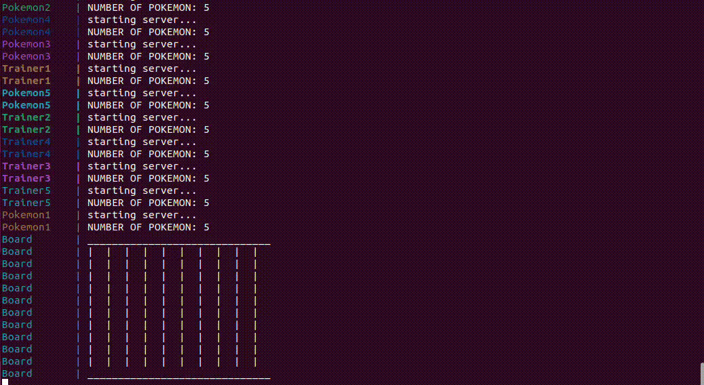

#### Bryce Jackson, bryce.e.jackson-1@ou.edu
### Distributed Operating Systems Final Project Documentation
#
## Description

In this project, I have solved the issues of coordination and synchronization within a distrinbuted system. This distributed system is comprised of docker-compose containers and runs on andy docker-compose capable platform. The project is organized into three (3) main python files, with a fourth python file as a driver/entry point for the program. The 'server.py' python file is the code pertaining to the pokemon game board, and the positions and states of pokemon and trainers. The 'server.py' code includes function definitions for captured(), Moves(), and Board(). Fucntion captured() is responsible for sending relevent pokemon/trainer capture information to the clients. Function Moves() includes the functionality to print the paths of each Trainer/Pokemon. Function Board() creates/prints the board environment and serves as the main server loop. Below are the highlights of each file and its functionality. The submit() RPC command is implemented for the sharing of path information when using Moves(). The CheckBoard() RPC command is created to allow for pokemon/trainer position data to be relayed for chasing/fleeing. TheMoveT() and MoveP() RPC are to relay information about and modify pokemon/trainer positions. 
The 'client1.py' file contains the funtionality for a Trainer entity. The trainer keeps track of their Path and PokeDex, and prints the, with the printPath() and pokeDex() functions, respectively. The Trainer entity is capable of doing the checkBoard() function via RPC messages to/from the server. The Trainer entity is also capable of Capture() functionality via RPC messages to/from the server. 
The 'client2.py' file contains the definition and functionality for a Pokemon entity. The pokemon keeps track of their path and Trainer information and prints them with Trainer() and Path() functions, respectively. The start() function performs the main client loop for the pokemon and communicates with the server to make RPC calls for position and state updates. 
The 'driver.py' file acts as the entry point for the application, launching each docker container in a synchronized manner. 

#
## <u>server.py (Board)</u>
### Functions: 
### getDim(): 
* get the dimension of the game board and return it. 

### Moves(): 
* Print the moves made and who made each move. 

### Setup(): 
* get the dimension and send it in a message to the client. 

### Capture(): 
* capture a pokemon when a trainer throws a pokeball. 

### Flee(): 
* run away from a trainer when a pokemon is near one!

### CheckBoard(): 
* check the board and returns relevant trainer/pokemon position info to the client.

### submit(): 
* trainer/pokemon submits their path to the server to be recorded. 

### MoveT(): 
* Move the player. When a player is next to a pokemon, move towards the pokemon.

### MoveP(): 
* Move the pokemon. When a player is next to a trainer, move away from the trainer. 
* also sends the caught response to the client when caught.

### board(): 
* in charge of drawing the game board and printing the trainers and pokemon on the board. 
* also serves as the main game loop for the server. 

#
## <u>client1.py (Trainer)</u>
### custom classes: 
* Step
    * has variables x, and y. 
* dexEntry
    * has variables x, and y of where the pokemon was caught. 
    * has variable face which is the emoji of the pokemon.

### **Functions:**

### pokeDex(dc):
* dc: the dexCounter variable (i.e. the number of dexEntries)
* functionality: to print the pokedex of a trainer

### printPath(sc): 
* sc: the stepCounter varbiable (i.e. the number of steps)
* functionality: to print the Path() the trainer traveled. 

### start(): 
* functionality: to start the trainer game loop

#
## <u>client2.py (Pokemon)</u>

### Functions:

### Path(sc):
* prints the path that the pokemon traveled. 

### start(): 
* acts as the entry point and main loop for the pokemon client. 

#
## <u> driver.py </u>
### Description: 
* The 'driver.py' file is in charge of coordinating the startup of the servers and clients when being run with docker-compose. 
#

## Demo! 
